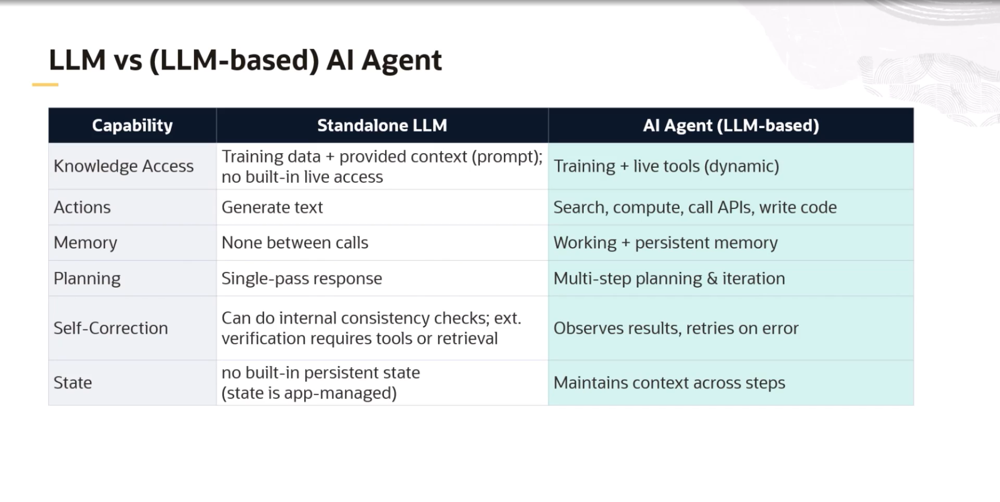
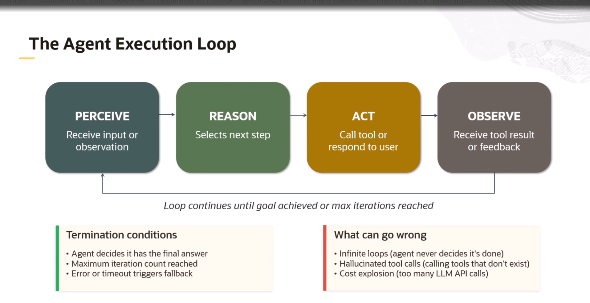
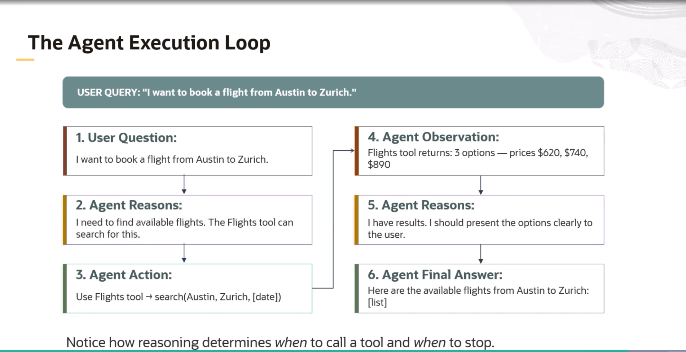

 # AI AGENT
  
**AI AGENT->** Thinks and decide next steps dynamically 

**AI AGENT->** LLM(Brain) + Tools(Hands) + Loop

- To remember my last question what i asked form my AI, we have to send all the  lastchat to LLM with new chat

- Langchain ka kaam hai tool ko call karna and LLM ko same message ko wapas feed krna

